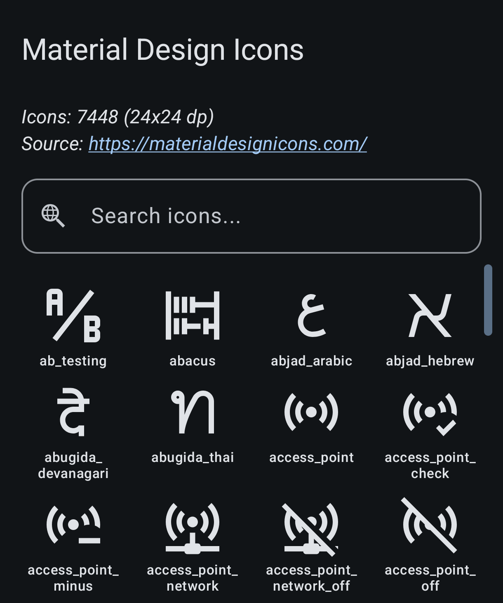
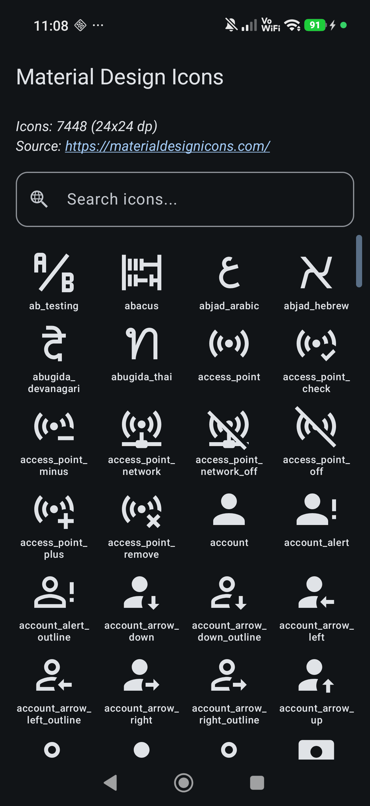
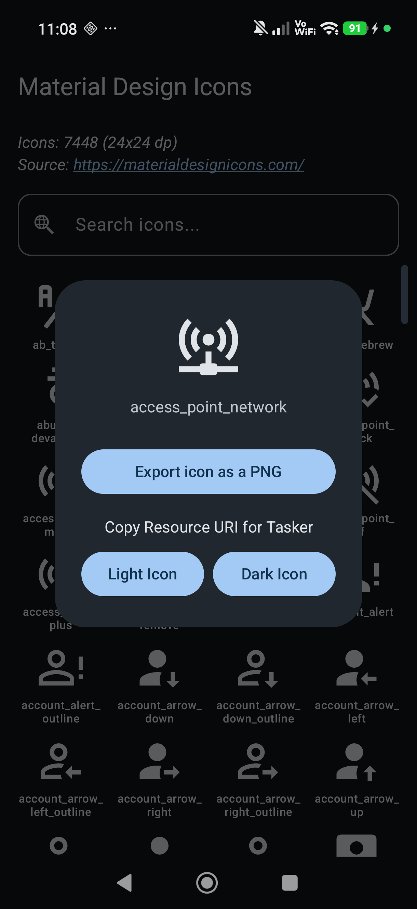
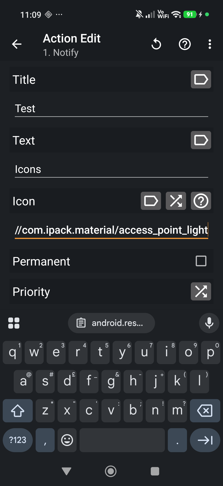
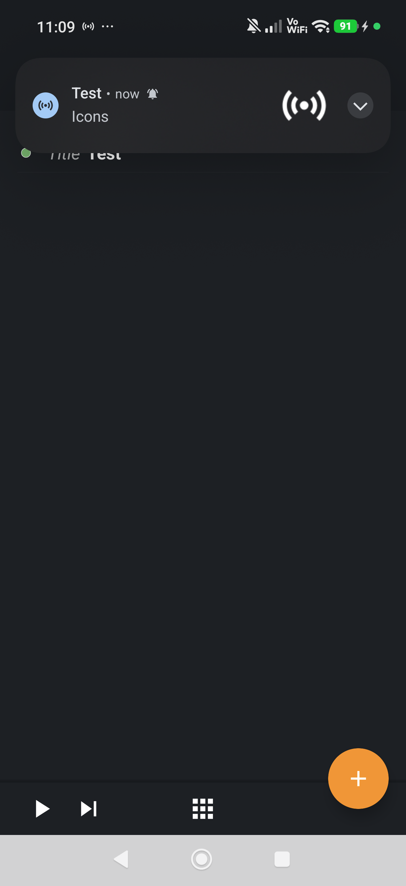
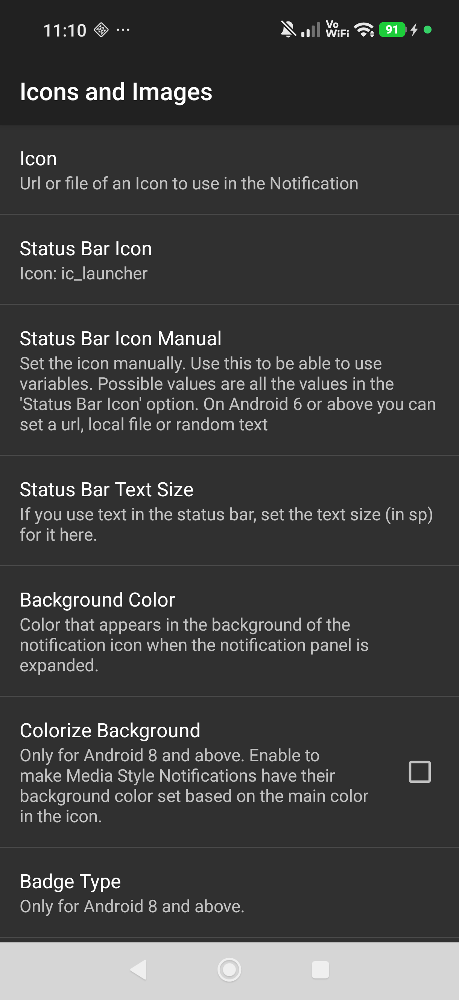
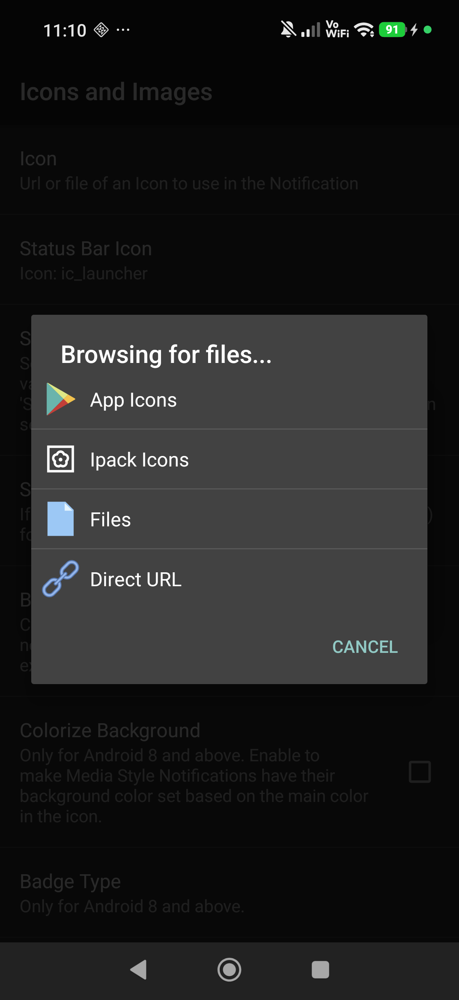
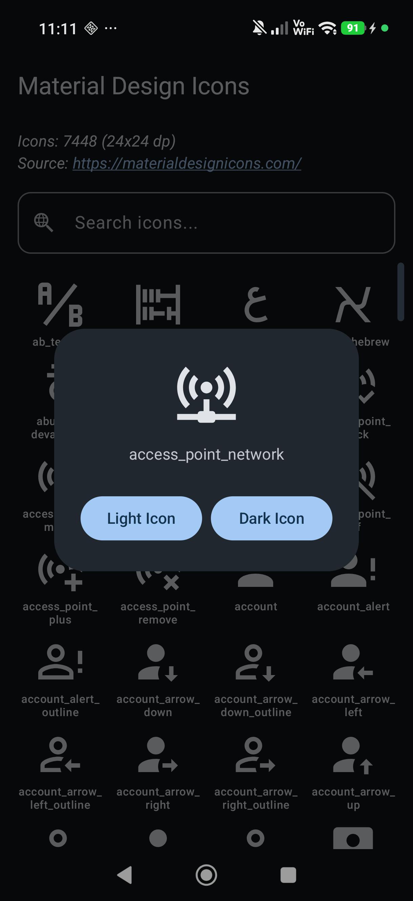

# Ipack Material Icons for Tasker

<p >
  
</p>

Android app providing Material Design icons to integrate with Tasker and related plugins.

> [!IMPORTANT]
> **Disclaimer**: All icons are sourced from
> the [Templarian/MaterialDesign](https://github.com/Templarian/MaterialDesign)
> project ([materialdesignicons.com](https://materialdesignicons.com/)). All credit for the icon
> designs goes to their respective creators and contributors.
> Credit for the original Ipack implementations that this is based off goes to the Tasker
> authors: [Tasker App Archive](https://tasker.joaoapps.com/apparchive/)

## Features

- **Extensive Library**: Access the full library of Material Design icons.
- **Tasker Integration**: Easily copy Resource URIs for use in Tasker tasks.
- **Ipack Integration**: Allows easy usage through Tasker Plugins such as AutoNotification.
- **PNG Export**: Export icons as PNG files for use in other applications.

## Installation

You can download the APK via
the [GitHub releases](https://github.com/RafhaanShah/IpackMaterialIcons/releases) page, or
through [Obtainium](https://obtainium.imranr.dev/).

[](https://github.com/RafhaanShah/IpackMaterialIcons/releases)
[](https://apps.obtainium.imranr.dev/)

## Usage

<details>
<summary><b>Tasker Integration</b></summary>

1. **Open the app** and tap the desired icon.
   <br>
2. **Choose the light or dark** version you want to use, this will copy the resource URI for Tasker.
   <br>
3. **Open Tasker** and go to your action, paste the URI into the desired Icon field.
   <br>
4. **Test your action** - you should see the icon in use.
   <br>

</details>

<details>
<summary><b>Plugin Integration (e.g. AutoNotification)</b></summary>

1. **Open the plugin configuration** and navigate to the icon selection, select 'yes' for "help
   selecting a file".
   <br>
2. **Select Ipack Icons** from the available options, and choose this app as the source.
   <br>
3. **Pick your icon** and the light or dark version to be used in the plugin.
   <br>

</details>

<details>
<summary><b>Dynamic Dark / Light Icon</b></summary>

1. **Create a new Tasker Profile:** State -> Display -> Dark Mode.
2. **Enter Task:** Set Variable -> `%IconColor` to `light` (so we use the light icon in Dark Mode)
3. **Exit Task:** Set Variable -> `%IconColor` to `dark` (so we use the dark icon in Light Mode)
4. **Icon Task:** Set your icon to `android.resource://com.ipack.material/icon_%IconColor`

</details>

## Building

### Prerequisites

- Android Studio.
- JDK 17 or higher.
- Git client.

### Cloning

This repository uses submodules for icon sources. Clone the repository recursively:

```bash
git clone --recursive --shallow-submodules https://github.com/RafhaanShah/IpackMaterialIcons.git
```

### Modules Overview

- **`:app`**: The main Android application module containing the UI (built with Jetpack Compose) and
  logic for icon selection and export.
- **`:icons`**: A library module that automatically generates Android Vector Drawables from SVG
  sources located in the `external/` directory during the build process.

## Contributing / Feature Requests

- Contributions via pull requests are welcome!
- For feature requests and issues please make a GitHub
  issue [here](https://github.com/RafhaanShah/IpackMaterialIcons/issues?q=is%3Aissue+is%3Aopen+sort%3Aupdated-desc)
  with details

## Third Party Libraries

- [skydoves/colorpicker-compose](https://github.com/skydoves/colorpicker-compose)
- [nanihadesuka/LazyColumnScrollbar](https://github.com/nanihadesuka/LazyColumnScrollbar)

## License

[MIT](https://choosealicense.com/licenses/mit/)
